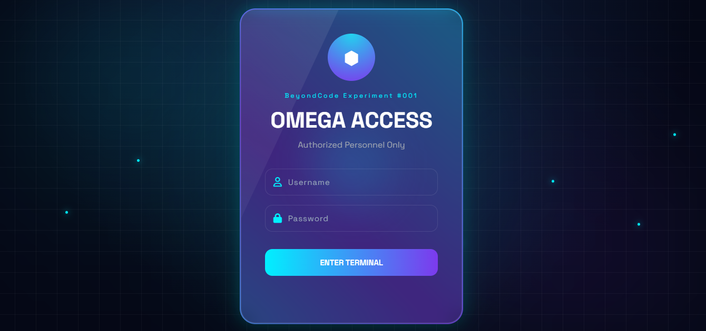

# BeyondCode Experiment 001 🚀

A frontend experiment project built to explore modern web design, responsive layouts, and interactive UI elements.

## 🌐 Technologies Used

- HTML5
- CSS3
- JavaScript

## ✨ Features

- Responsive design
- Custom UI components
- Interactive animations
- Modern styling techniques

## 📸 Preview

## 📂 Project Structure

BeyondCode-Experiment-001
│
├── assets
│ └── logo.png
├── index.html
├── style.css
└── script.js

## 👩‍💻 Author

Maimoona Shafique